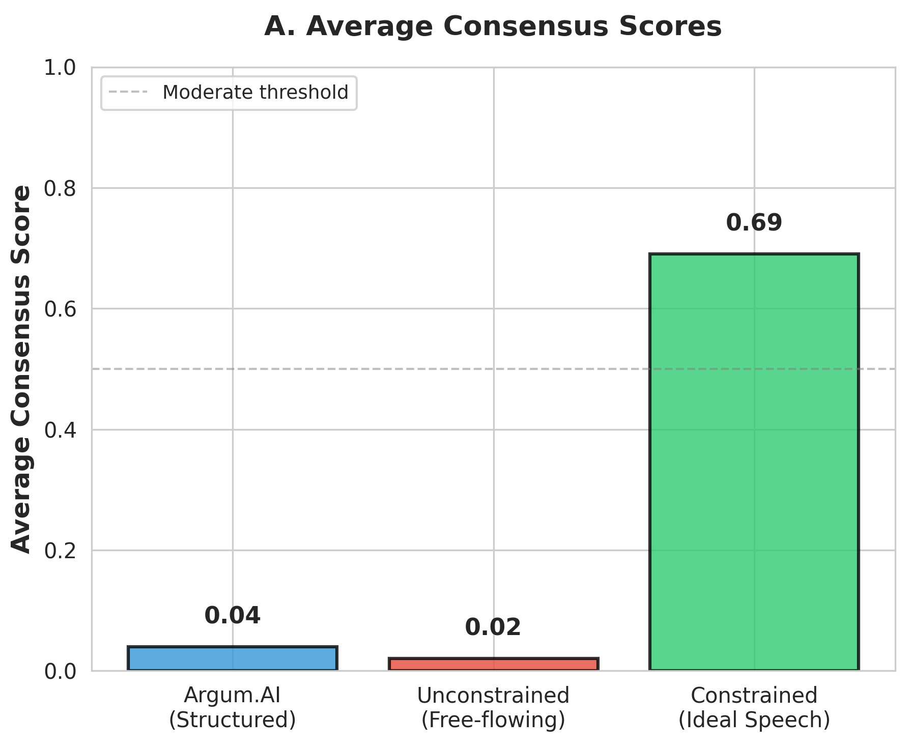
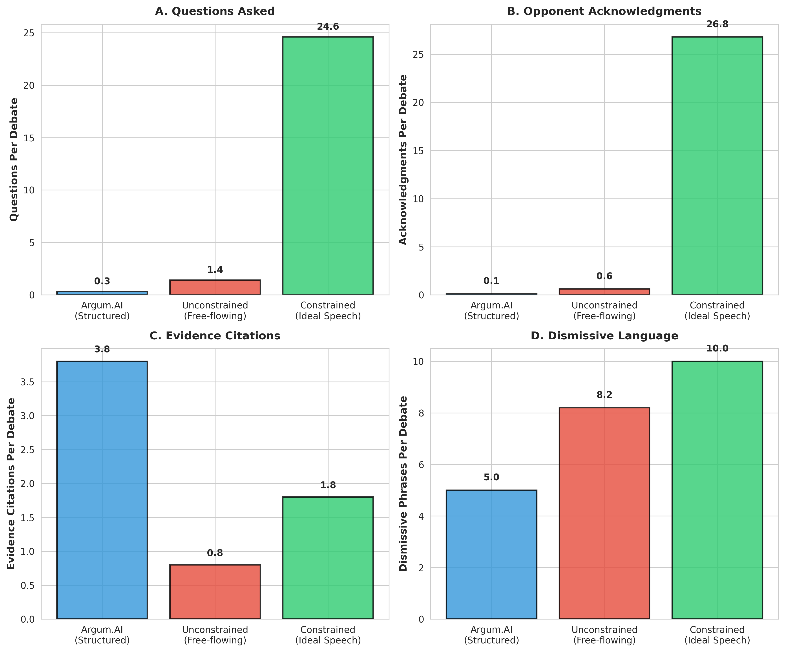
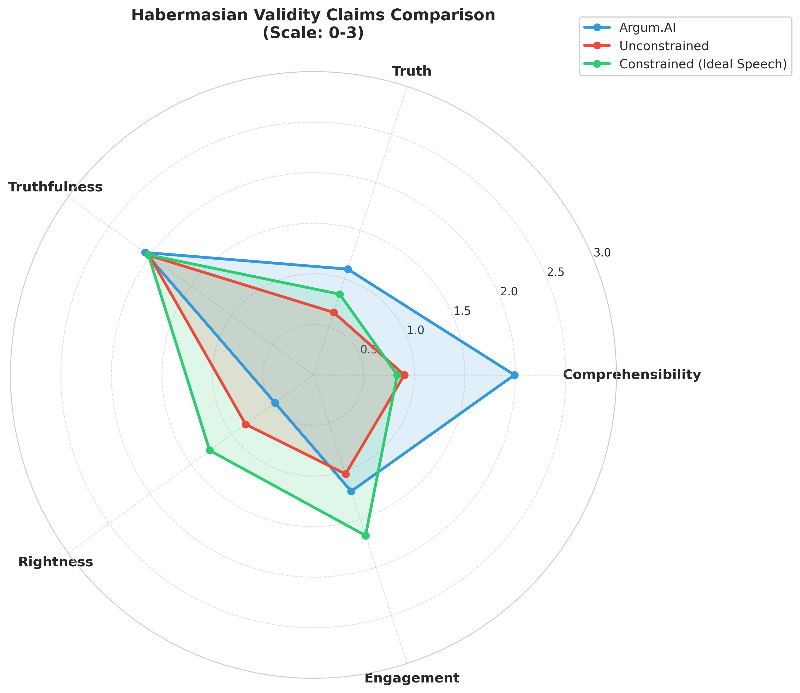
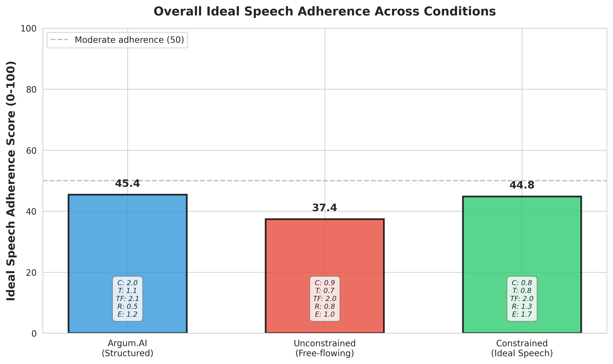
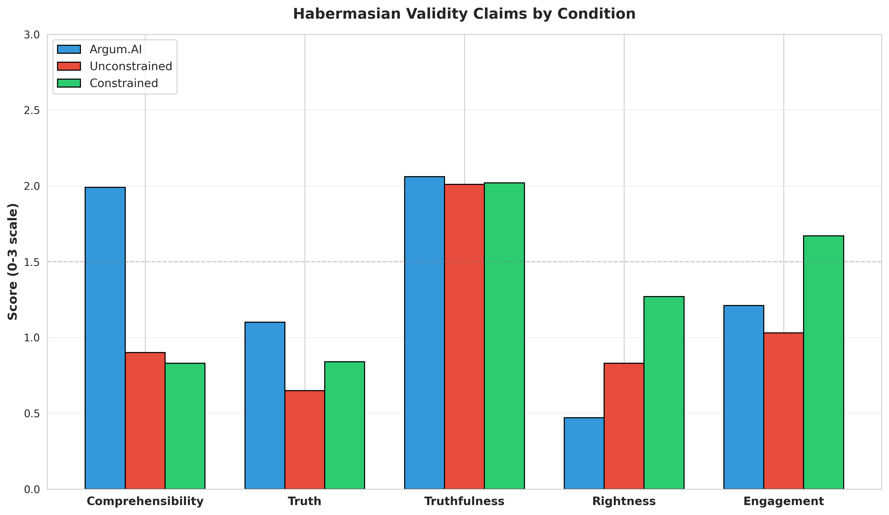

# Simulating Habermas’s Ideal Speech Situation: Does Rational Consensus Emerge in Constrained Multi-Agent LLM Debates?

This paper asseses whether Large Language Models (LLMs) adhere to Jürgen Habermas's Ideal Speech Situation principles during unconstrained debates, and whether explicitly constraining LLMs with ideal speech rules affects consensus formation and epistemic quality.

## Repository Structure
| File/Folder | Description |
|-------------|-------------|
| `analysis_graphs/` | Visualization outputs showing consensus scores, validity claims, and behavioral indicators across setups |
| `argum_transcripts/` | Debate transcripts from Setup 1 (Argum.AI structured debates, n=10) |
| `debate_transcripts/` | Debate transcripts from Setup 3 (ideal speech-constrained free-flowing debates, n=10) |
| `debatewithoutconstraints_transcripts/` | Debate transcripts from Setup 2 (unconstrained free-flowing debates, n=10) |
| `results/` | Analysis outputs including consensus detection scores and ideal speech adherence metrics for all setups |
| `README.md` | README for documentation and overview |
| `analysis.py` | Python script for analyzing ideal speech adherence in a single debate transcript |
| `batch_analysis.py` | Python script for analyzing ideal speech adherence across multiple debate transcripts |
| `consensus_detection.py` | Python script for detecting consensus formation in single or batch debate transcripts |
| `debate.py` | Python script to simulate three-agent debates under ideal speech rule constraints |
| `debate_withoutidealspeechconstraints.py` | Python script to simulate three-agent unconstrained debates with minimal instructions |
| `topics.txt` | List of 10 debate topics used across all experimental conditions |
| `haebarmas_ideal_discourse.pdf` | PDF of Research Paper |

## Research Questions
- In unconstrained debate between LLM agents, are ideal speech principles followed?
- If LLM agents are constrained by the rules of ideal speech, is consensus more likely to appear?
- Does ideal speech enforcement affect the epistemic quality of arguments exchanged (such as argument validity, evidential grounding and consideration of counterarguments)?

## Overview
30 debates are conducted across three experimental setups using 10 common debate topics. The first setup analyzed existing debates between agents published on the web. The second setup created unconstrained free-flowing debates with three LLM agents. The third setup replicated the free-flowing structure but explicitly constrained agents with 8 ideal speech rules derived from Habermas’s framework.

Results show unconstrained debates systematically violate ideal speech principles, achieving 0 consensus, asking minimal questions and rarely acknowledging opponents. Explicit ideal speech constraints improved likelihood of consensus, question-asking and opponent acknowledgement. However, evidential grounding remained weak across all setups.

There are significant limitations to this study, including the fundamental impossibility of LLMs satisfying Habermas's sincerity principle (asserting only genuine beliefs) since they lack beliefs. Despite these limitations, results demonstrate that explicit Habermasian constraints meaningfully alter LLM discourse patterns, suggesting that ideal speech rules do indeed lead to more consensus (at least in the virtual world) and indicate potential for AI-mediated deliberation systems that support democratic discourse principles.

## Experiment Design
This research employed 3 experimental setups to examine ideal speech principle adherence and consensus formation in LLM debates. All three setups used the same 10 debate topics to enable direct comparison, with debates reaching similar overall lengths across conditions despite different structural constraints.

### Setup 1: Argum.ai structured debates
Argum (Argum.ai 2024) is a platform that facilitates structured debates between AI agents. Users select debate topics and models, and the framework evaluates debates to reach verdicts. Ten publicly published debates were randomly selected from this platform:
- Is teamwork or solo work better?
- Is exercise or diet an easier way to lose weight?
- Is it better to limit social media use versus accepting it as integral to modern life?
- Should you save for the future or enjoy your money while you can?
- Is it better to delegate tasks or do it yourself to ensure quality?
- Would you rather have a stable job or a risky business with high returns?
- Should you pay off debt first or start investing early?
- Financial freedom: Focusing on passive income versus active investments
- Does social media inspire more than it fosters competition?
- You get a promotion that doubles your pay but triples your stress. Take the money or protect your sanity?

Each debate here consisted of exactly 6 turns following a rigid format- 2 opening statements, 2 rebuttals, and 2 closing statements, with agents alternating turns. We do not have access to the system prompts used to initialize agents, so we cannot determine whether ideal speech principles were explicitly encoded. However, the structured format itself imposes procedural constraints on argumentation. Argum provided a baseline dataset to analyze whether ideal speech constraints were being followed by out-of-the-box LLMs and whether consensus was being reached.

### Setup 2: Unconstrained Free-Flowing Debate
To test whether ideal speech principles emerge naturally without explicit enforcement, unconstrained debates were conducted using the same 10 topics with three LLM agents (llama-3.3-70b-versatile).
Unlike Argum’s fixed structure, this setup implemented free-flowing debate consistent with Habermas’s principle of equal participation rights. After each statement, agents independently decided whether to speak and rated their confidence in this decision (0.0-1.0). Confidence ratings served two purposes:
- They provided a measure of agents’ certainty about their participation choices, allowing analysis of whether agents exhibited the overconfidence patterns documented in previous LLM debate research (Prasad and Nguyen 2025)
- They operationalized Habermas’s accountability principle by requiring agents to explicitly represent their level of conviction when choosing to speak or remain silent.

All agents made opening statements to initiate debate. Subsequently, agents could speak when they chose, but could not speak consecutively: an agent who had just spoken was required to pass their next turn. This constraint prevented domination while preserving voluntary participation.
Debates ended when 30 turns were reached, 5 minutes elapsed or all agents consecutively passed, indicating no further substantive contributions (an end had to be imposed due to computational resource constraints).

### Setup 3: Ideal Speech-Constrained Debate
The third setup maintained the free-flowing structure but explicitly encoded Habermas's discourse principles in agent initialization. Agents were instructed to explicitly follow ideal speech rules:
1. **Truthfulness**: Make only claims you believe to be true and can support with reasoning
2. **Sincerity**: Express your genuine understanding and beliefs
3. **Rationality**: Provide logical arguments and valid reasoning
4. **Comprehensibility**: Express ideas clearly and accessibly
5. **Respect**: Acknowledge others' arguments fairly before responding
6. **Good Faith**: Aim to reach mutual understanding, not just "win"
7. **No Fallacies**: Avoid ad hominem, strawman, and other logical fallacies
8. **Evidence-Based**: Support claims with reasoning or evidence when possible

## Analysis Methods
Debate transcripts from all 3 setups were analyzed on two primary dimensions: 
- Consensus Achievement: Whether agents reached agreement on the debate topic by the conclusion
- Ideal Speech Adherence: Evaluation of violations across Habermas’s three levels of rules (logical consistency, procedural norms and processual preconditions).

## Results
- Agents under ideal-speech constraints showed more consensus.
- More questions were asked under ideal-speech constraints.
- Constrained debates substantially outperformed in engaging with opponents.
- There is consistency with previous litearture i.e. the near-total absence of questions (mean: 1.4 per debate) mirrors Prasad and Nguyen's (2025) documentation of LLM overconfidence in debates, where agents fail to seek clarification or acknowledge uncertainty. The minimal opponent acknowledgment (mean: 0.6 per debate) reflects Taubenfeld et al.’s (2024) finding that LLMs conform to inherent biases despite role assignments. The lack of evidence citation (mean: 0.8 per debate) corroborates Breum et al.’s (2024) observation that LLMs may leverage stylistic patterns rather than substantive reasoning.
- In some cases there was unequal participation. Whether this reflects natural discourse dynamics or violates Habermasian equality principles requires human judgment.

## Conclusions
#### In unconstrained debate between LLM agents, are ideal speech principles followed?

**Conclusion 1:** LLM debates without ideal speech rules systematically violate Habermasian principles. They ask minimal questions, rarely acknowledge opponents and achieve zero consensus. Agents without ideal speech rules default to assertive, adversarial argumentation.

#### If LLM agents are constrained by the rules of ideal speech, is consensus more likely to appear?

**Conclusion 2:** Consensus is more likely to appear when LLM agents are constrained by the rules of ideal speech. Ideal speech-constrained debates achieved some sort of consensus in 100% of the cases, demonstrating that explicit Habermasian constraints create conditions for rationally motivated consensus.

#### Does ideal speech enforcement improve the epistemic quality of arguments exchanged?

**Conclusion 3:** Ideal speech enforcement partially improved the epistemic quality of arguments being exchanged between agents. It substantially improved consideration of counterarguments and acknowledgment of opponents. However, grounding arguments in evidence remained weak across all setups. This could mean that procedural constraints enhance dialogue engagement but do not automatically enhance rigor of arguments.
